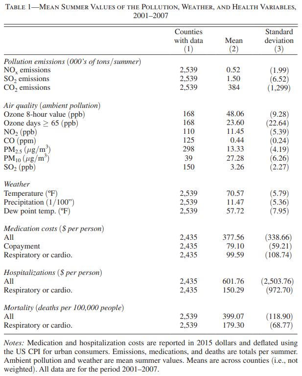
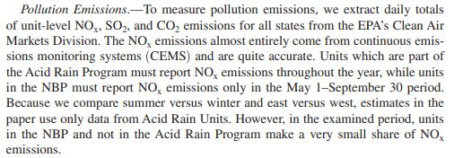

# Paper Replication Assignment 3: Make Table 1

In this assignment you will use the functions that you have learned to
replicate the Pollution emissions and Air quality section of Table 1 in
*Defensive Investments and the Demand for Air Quality: Evidence from the
NOx Budget Program* by Deschênes et al. (2017).



## Part 1: Create a balanced panel dataframe

Step 1: Declare that you will use the **tidyverse** and **knitr**
package. **(2 points)**

``` r
library("tidyverse")
library("knitr")
```

Step 2: Upload pollution emissions data from the year 2001 to 2007 into
the environment and combine them together into one dataframe called
**df. (2 points)**

``` r
df2001<-read.csv("EPA AMPD/emission_2001.csv")
df2002<-read.csv("EPA AMPD/emission_2002.csv")
df2003<-read.csv("EPA AMPD/emission_2003.csv")
df2004<-read.csv("EPA AMPD/emission_2004.csv")
df2005<-read.csv("EPA AMPD/emission_2005.csv")
df2006<-read.csv("EPA AMPD/emission_2006.csv")
df2007<-read.csv("EPA AMPD/emission_2007.csv")

df<-rbind(df2001, df2002, df2003, df2004, df2005, df2006, df2007)
```

#### Question 1: What is the unit of NOx, SO2, and CO2 pollution emissions in Table 1? Fill in the blank. **(3 points)**

#### Answer: Thousand tons per county (state/city/county) during the summer months of each year.

Step 3: Create a new dataframe named **df2** which has the total
**summertime** NOx, SO2, and CO2 emissions (in **thousand tons**) for
each **County**, **State**, and **Year**. Note that the summer months
include May through September. **(4 points)**

``` r
df2<-df %>%
  filter(Month>=5 & Month<=9) %>%
  mutate(NOx=ifelse(!is.na(NOx..tons.), NOx..tons., 0)) %>%
  mutate(SO2=ifelse(!is.na(SO2..tons.), SO2..tons., 0)) %>%
  mutate(CO2=ifelse(!is.na(CO2..short.tons.), CO2..short.tons., 0)) %>%
  group_by(County, State, Year) %>%
  summarize(NOx=sum(NOx)/1000, SO2=sum(SO2)/1000, CO2=sum(CO2)/1000)
```

#### **Question 2: The script below shows the number of observations per county. Ideally, a county should have 7 observations as there are 7 years of data. Why does Acadia Parish have only 6 observations? Why does Adams County have 35 observations? (2 points)**

#### Answer:

#### There are no large electricity generating units in Acadia Parish in 2001, so they did not report their emissions.

**Adams County exists in many states (CO, MS, NE, OH, PA)**

``` r
head(table(df2$County))
```


      Acadia Parish Accomack County    Adams County    Aiken County  Alachua County 
                  6               7              35               7               7 
      Albany County 
                  7 

Step 4: In this step, you will create a list of counties used in
Deschenes et al. (2017).

Step 4.1: First, you will need to upload *counties_list.csv*, which
contains the list of every county in the United States, into the RStudio
environment. Call the dataframe **counties**. **(1 point)**

``` r
counties<-read.csv("counties_list.csv")
```

Step 4.2: According to the paragraph below, Deschenes et al. (2017)
analyzed units regulated by the Acid Rain Program. Create a new
dataframe called **df3** from **df** which contains only units that were
regulated by the Acid Rain Program. Note that these units have the value
“**ARP**” or “**ARP, NBP**” in the Program.s. column. **(2 points)**



``` r
df3<-df %>%
  filter(Program.s.=="ARP" | Program.s.=="ARP, NBP")
```

Step 4.3: The script below keeps only counties used in the analysis by
Deschenes et al. (2017).

First, we created a vector called **st_arp** which contains states
regulated by the Acid Rain Program. After that, we remove states
regulated by the Acid Rain Program, but not states that are adjacent to
the NBP states in a new vector called **st**. Afterward, a new dataframe
called **counties2** which only contains states in **st** is created.
You just have to run the code chunk below.

``` r
st_arp<-unique(df3$State)

drop<-c("WI", "MO", "ME", "NH", "VT", "GA", "MS", "IA")

st<-st_arp[!st_arp %in% drop]

counties2<-counties %>%
  filter(State %in% st) 
```

Step 5: To make an accurate summary statistics table, we need to make a
balanced panel with all the counties and year that we are interested in.
The table will summarize data from all counties and all years.

This can be done by first creating a vector of all the years we are
interested in. Afterward, we will use the **crossing** function to
create a combination of all the counties and year we are interested in.
Since we have 7 years and 2253 counties, the balanced panel will have 7
x 2,542 = 17,794 observations.

The code is shown below. You just have to run it.

``` r
Year<-seq(2001,2007,by=1)

cy<-crossing(counties2, Year)
```

Step 6: Next, we will add the emissions data from **df2** into **cy**.

#### Question 3: What three variables do df2 and cy have in common? (3 points)

#### Answer: County, State, Year

Step 6.1: Add the emissions data from **df2** into **cy** by using the
**merge** function by matching observations that has the same **State**,
**County**, and **Year**. Name the merged dataframe **emit.**

Make sure that the dataframe **emit** has all the observations in
**cy**, but not the observations in **df2** that does not match with
**cy**.

Hint: You learned how to do this in [this DataCamp
video.](https://campus.datacamp.com/courses/joining-data-with-datatable-in-r/joining-multiple-datatables?ex=8)
**(4 points)**

``` r
emit<-merge(cy, df2, by=c("State", "County", "Year"), all.x=TRUE)
```

Step 6.2: Create a new dataframe named **emit2** from **emit.** Replace
all the NA values that the columns that represent NOx, SO2, and CO2
emissions with 0. You now have a balanced panel dataframe. **(1 point)**

``` r
emit2<-emit %>%
  mutate(NOx=ifelse(!is.na(NOx), NOx, 0)) %>%
  mutate(SO2=ifelse(!is.na(SO2), SO2, 0)) %>%
  mutate(CO2=ifelse(!is.na(CO2), CO2, 0)) 
```

## Part 2: Summarize emissions variables

Step 1: Create a new dataframe called **emit_mean** from **emit2**. Use
the **summarize** and **mean** function to find the average NOx, SO2,
and CO2 emissions across all counties and years. Name the variables
**mean_NOx**, **mean_SO2**, and **mean_CO2**. **(1 point)**

``` r
emit_mean<-emit2 %>%
  summarize(mean_SO2=mean(SO2), mean_CO2=mean(CO2), mean_NOx=mean(NOx))
```

Step 2: Create a new dataframe called **emit_sd** from **emit.** Use the
**summarize** and **sd** function to find the standard deviation of NOx,
SO2, and CO2 emissions across all counties and years. Name the variables
**sd_NOx**, **sd_SO2**, and **sd_CO2**. **(1 point)**

``` r
emit_sd<-emit2 %>%
  summarize(sd_SO2=sd(SO2), sd_CO2=sd(CO2), sd_NOx=sd(NOx))
```

Step 3: We will use the **pivot_longer** function to format our results
in table format of the original paper. The code is shown below. You just
have to run it.

``` r
mean_long<-pivot_longer(emit_mean,
                        cols=1:3,
                        names_to = "Pollution emissions (000's of tons/summer)",
                        names_prefix="mean_", 
                        values_to = "Mean") 

sd_long<-pivot_longer(emit_sd,
                        cols=1:3,
                        names_to = "Pollution emissions (000's of tons/summer)",
                        names_prefix="sd_", 
                        values_to = "SD") 

T1a<-merge(mean_long, sd_long, 
           by="Pollution emissions (000's of tons/summer)") %>%
  mutate(n=nrow(counties2)) 

kable(T1a, digits=2)
```

| Pollution emissions (000’s of tons/summer) |   Mean |      SD |    n |
|:-------------------------------------------|-------:|--------:|-----:|
| CO2                                        | 383.86 | 1298.82 | 2542 |
| NOx                                        |   0.54 |    2.00 | 2542 |
| SO2                                        |   1.50 |    6.51 | 2542 |

Step 4: Check that your summary statistics are similar to the one in
Deschenes et al. (2017).

Step 5: Remove all lines of script with #\| eval: false which prevents
the line from running when rendered. Afterward, click Render to generate
an html file of this document. Click Render to generate an html file of
this document. **(1 point)**

You have reached the end of the assignment. Save the files and push the
completed assignment back into the GitHub repository.
